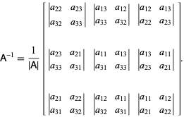

# Práctica 1

## Fecha: 19 febrero de 2021

## Temas: Aplicaciones de la Eliminación Gaussiana (Matriz inversa)

## Descripción de la práctica

En esta práctica se deberá utilizar la eliminación Gaussiana para calcular la invesa de una matriz. Las [aplicaciones](https://www.tandfonline.com/doi/abs/10.1080/0020739820130114) del cálculo de la inversa de una matriz son múltiples.

El estudiante deberá modificar el método de la eliminación Gaussiana para calcular la inversa de una matriz. 

Además de calcular la inversa de una matriz, se deberá aplicar este método para resolver un problema con una aplicación en el mundo real. Es posiblie utilizar como base alguna aplicación descrita en las siguientes fuentes: 

[paper1](https://www.jstor.org/stable/2282499?seq=1)

[paper2](https://www.tandfonline.com/doi/abs/10.1080/0020739820130114)
