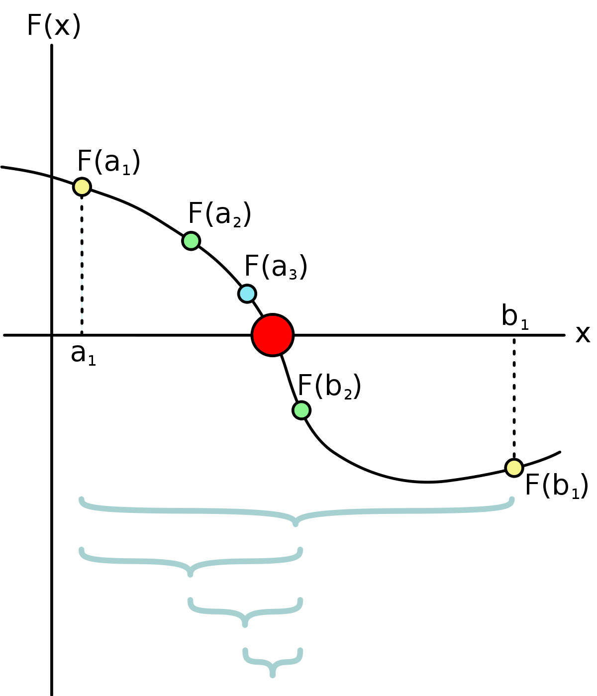

# Práctica 2
## Fecha: 26 febrero de 2021
## Tema: Raices de polinomios (El método de la bisección)

En esta práctica se deberá utilizar el método de la bisección para encontrar las raices reales de funciones o polinomios. 

El estudiante deberá hacer una comparativa entre el método de exploración exhaustiva (ingenua) y el método de la bisección.

Se deberá usar como base el siguiente código en [Google Colab](https://colab.research.google.com/drive/1E-gi8H1nND8zrnLDrKomcEbUp-oE_u82?usp=sharing)
